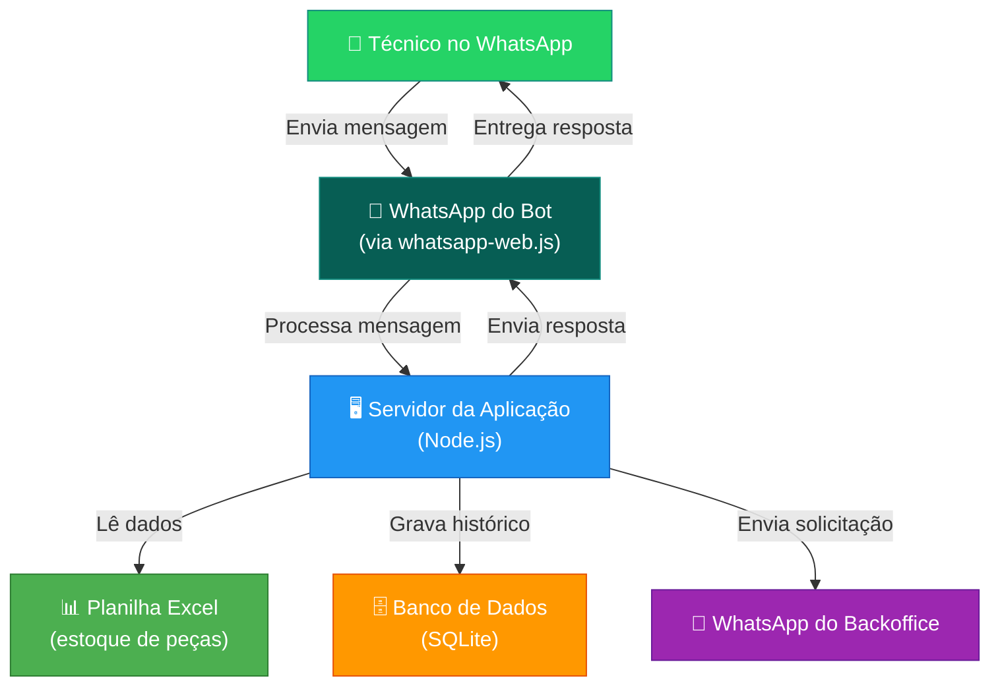
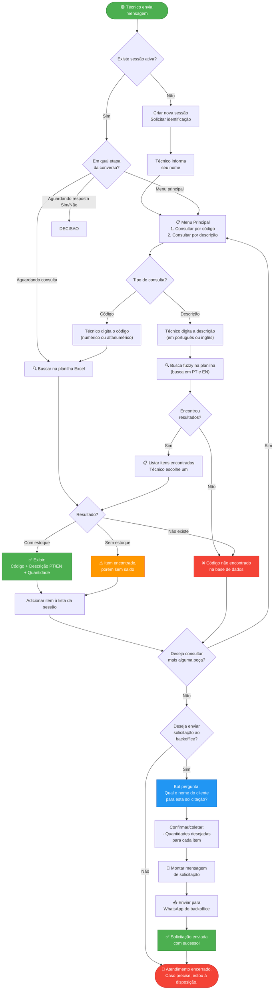
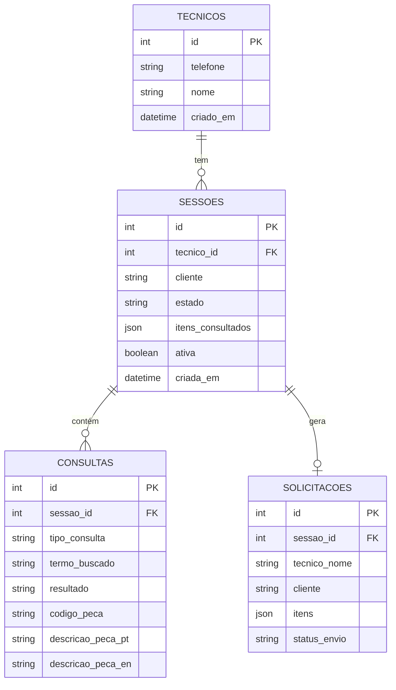
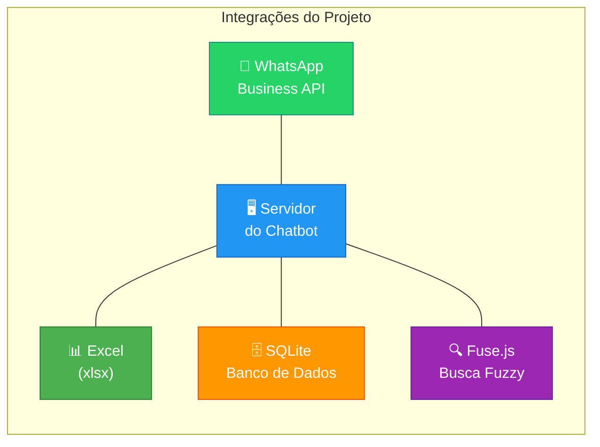
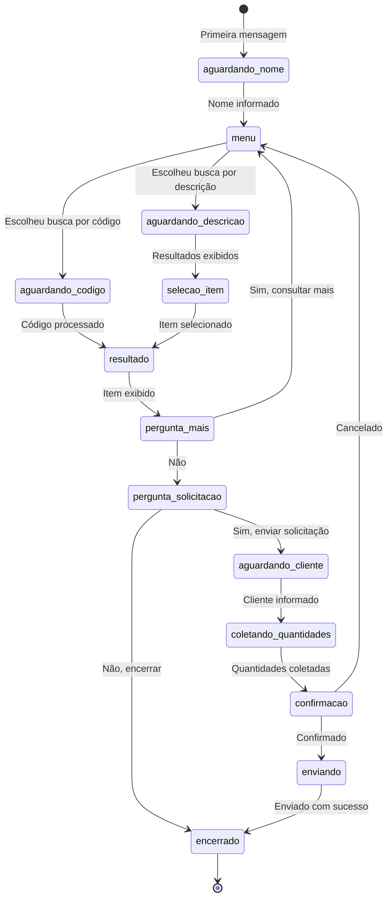
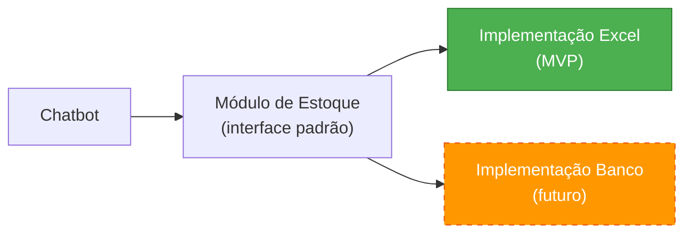
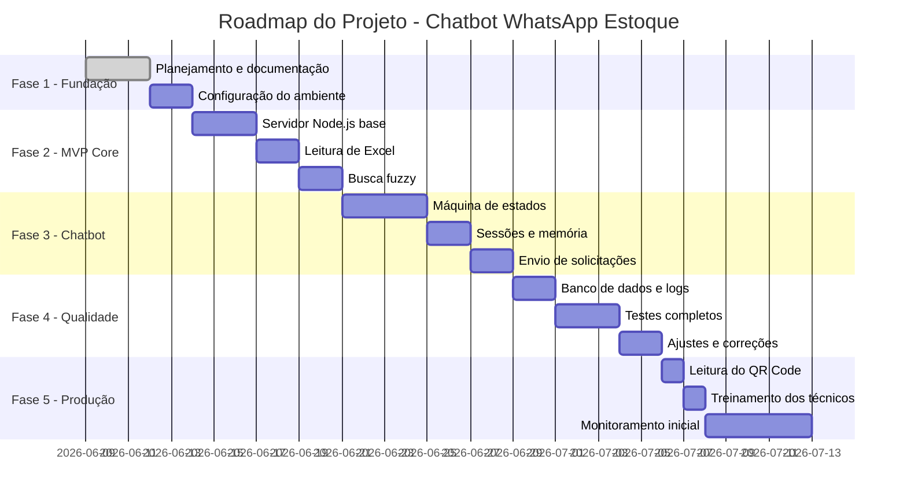

# 🎉 Seu Chatbot Está Pronto!

Toda a programação que planejamos para as Fases 2, 3, 4 e 5 foi concluída. O "cérebro" do seu assistente de WhatsApp já está construído e pronto para ser usado.

## O Que Foi Programado?

✅ **Módulo de Excel (`src/estoque/excel.js` e `search.js`)**
O bot sabe ler sua planilha `.xlsx`, cruzar dados e possui uma **busca inteligente (Fuzzy Search)** para aceitar erros de digitação (ex: se o técnico digitar "fote 24", ele encontrará a "Fonte 24V"). Ele busca simultaneamente em inglês e português!

✅ **Módulo de Banco de Dados (`src/database/`)**
Construímos um banco de dados embutido (SQLite) chamado `database.sqlite` (ele será criado na primeira vez que você rodar o bot). Ele guarda, de forma 100% invisível:
- O histórico de conversas do técnico.
- As consultas realizadas (para auditoria).
- Os itens colocados no "carrinho" de solicitações.

✅ **Cérebro do Chatbot (`src/chatbot/`)**
A "Máquina de Estados" foi finalizada. Isso garante que o bot não se perca na conversa. Ele entende:
- Quando deve perguntar o seu nome.
- Quando está aguardando o código de uma peça.
- Quando deve perguntar o nome do Cliente (apenas antes de enviar a solicitação).
- Quando coletar as quantidades.

✅ **Conexão WhatsApp (`src/whatsapp/`)**
Configurado com `whatsapp-web.js`. Ele irá gerar um QR Code no seu terminal para conectar diretamente.

---

## 🚀 Como Ligar o Chatbot Agora?

Siga estes passos exatos, direto do seu computador:

### 1. Coloque a Planilha de Estoque
Dentro da pasta `Programação\chatbot-whatsapp-estoque`, existe uma pasta chamada **`data`**. 
Coloque o seu arquivo Excel de verdade lá dentro.
> **Importante:** O arquivo **precisa** se chamar `estoque.xlsx`.

### 2. Instale as Bibliotecas
Se ainda não o fez, dê um duplo clique no arquivo **`instalar.bat`** (na mesma pasta principal). 
Deixe a tela preta terminar de rodar até dizer que o processo foi concluído com sucesso. Isso é feito **apenas uma vez**.

### 3. Ligue o Bot e Conecte o WhatsApp
1. Dê um duplo clique no arquivo **`iniciar_bot.bat`**.
2. A tela preta (terminal) vai abrir, carregar as bibliotecas e **desenhar um QR Code** nela mesma.
3. Pegue o celular que será o "Bot", abra o WhatsApp (ou WhatsApp Business).
4. Vá em **Configurações > Aparelhos Conectados > Conectar Aparelho**.
5. Aponte a câmera do celular para a tela preta do seu computador.
6. A tela exibirá a mensagem `✅ BOT INICIADO E PRONTO PARA RESPONDER!`.

### 4. Teste Você Mesmo
Pegue seu celular pessoal e mande uma mensagem (ex: "Olá") para o número do celular do Bot que você acabou de conectar.
Ele vai te responder pedindo seu nome e iniciando o menu de estoque!

---

> [!TIP]
> **Dica para o número do Backoffice:** Para que o seu time de backoffice receba a lista final de pedidos formatada, lembre-se de configurar o arquivo `.env` (que criei na raiz da pasta). Abra-o no Bloco de Notas e altere o `BACKOFFICE_PHONE` para o número correto com DDI (Ex: 5511999999999).
# 📱 CHATBOT DE WHATSAPP — CONSULTA DE ESTOQUE E SOLICITAÇÃO DE PEÇAS

## Documentação Completa do Projeto

---

# 1. RESUMO EXECUTIVO

Este projeto tem como objetivo criar um **chatbot de WhatsApp** que permitirá aos **técnicos de campo** da empresa:

1. **Consultar peças em estoque** — informando o código ou a descrição da peça.
2. **Enviar solicitações ao backoffice** — pedindo peças com todos os dados necessários.

### O que o chatbot faz em linguagem simples

O sistema é composto por um programa único no seu computador.

1. **Celular Técnico**: O técnico manda uma mensagem pelo WhatsApp (ex: "Preciso da fonte 24V").
2. **WhatsApp da Empresa**: O WhatsApp recebe a mensagem.
3. **Bot (whatsapp-web.js)**: Nosso sistema em Node.js está conectado ao seu WhatsApp via Web (lendo QR Code) e "escuta" todas as mensagens que chegam.
4. **Gerenciador de Estado**: O sistema verifica em que ponto da conversa o técnico está (é a primeira mensagem? Ele está buscando? Já encontrou e quer pedir?).
5. **Busca (Fuse.js / Excel)**: O sistema lê a planilha Excel em memória e procura a peça solicitada.
6. **Resposta (whatsapp-web.js)**: O sistema manda a resposta de volta pelo WhatsApp. Se for uma solicitação, manda uma mensagem extra para o número do Backoffice.

### Benefícios esperados

| Benefício | Descrição |
|---|---|
| ⏱️ **Agilidade** | Consulta instantânea, sem esperar resposta humana |
| 📉 **Redução de erros** | Dados padronizados, sem mal-entendidos por telefone |
| 📊 **Rastreabilidade** | Todas as consultas e solicitações ficam registradas |
| 📱 **Acessibilidade** | Funciona pelo WhatsApp, que todo técnico já usa |
| 🔄 **Escalabilidade** | Pode atender dezenas de técnicos ao mesmo tempo |

---

# 2. ARQUITETURA RECOMENDADA

## Diagrama da Arquitetura



## Componentes da arquitetura

| Componente | O que é | Tecnologia Recomendada |
|---|---|---|
| **WhatsApp Client** | O "canal" de comunicação integrado | whatsapp-web.js (simula WhatsApp Web) |
| **Servidor da Aplicação** | O "cérebro" do chatbot que processa as mensagens | Node.js com Express |
| **Planilha Excel** | Onde estão os dados do estoque | Arquivo `.xlsx` lido pela biblioteca `xlsx` |
| **Banco de Dados** | Onde ficam salvos históricos, sessões e logs | SQLite (com better-sqlite3) |
| **Busca Inteligente** | Permite encontrar peças por descrição aproximada | Biblioteca `fuse.js` |

---

# 3. EXPLICAÇÃO DA ARQUITETURA EM LINGUAGEM SIMPLES

## Glossário de Termos Técnicos

Antes de explicar a arquitetura, veja o significado dos termos que aparecerão:

| Termo | Explicação Simples |
|---|---|
| **WhatsApp-web.js** | Biblioteca que conecta seu código ao WhatsApp Web, permitindo ler e enviar mensagens automaticamente. |
| **Servidor** | É um computador que fica ligado 24h, rodando o programa do chatbot. Pode ser um computador na empresa ou um serviço na nuvem (como alugar um computador na internet). |
| **Banco de Dados** | É como um arquivo organizado onde o sistema guarda informações de forma estruturada — como uma planilha, mas mais poderosa e rápida. |
| **JSON** | É um formato de texto que computadores usam para trocar informações. Parece uma lista organizada com rótulos e valores. |
| **Node.js** | É uma ferramenta que permite rodar programas escritos em JavaScript (uma linguagem de programação) em servidores. |
| **SQLite** | É um banco de dados simples que funciona como um único arquivo. Ideal para começar. |
| **Fuzzy Search** | Busca "inteligente" que encontra resultados mesmo quando a digitação não é exata. Ex: digitar "pwr suply" e encontrar "Power Supply". |
| **MVP** | Produto Mínimo Viável — a versão mais simples do projeto que já funciona e entrega valor. |
| **LGPD** | Lei Geral de Proteção de Dados — lei brasileira que regula como dados pessoais devem ser tratados. |
| **Sessão** | É como uma "conversa em andamento". Enquanto o técnico está usando o chatbot, o sistema lembra do que já foi consultado. |

## Como funciona na prática

Pense no chatbot como uma **loja com atendente automático**:

1. **O técnico (cliente)** manda uma mensagem pelo WhatsApp.
2. **O whatsapp-web.js (porteiro)** recebe a mensagem e avisa o servidor.
3. **O servidor (atendente)** lê a mensagem, entende o que o técnico quer, consulta o estoque na planilha Excel e prepara a resposta.
4. **A resposta volta** pelo mesmo caminho: servidor → whatsapp-web.js → técnico.
5. Se o técnico pedir peças, o servidor monta uma **solicitação formal** e envia para o WhatsApp do backoffice.

---

# 4. FLUXOGRAMA DETALHADO DO PROCESSO



---

# 5. JORNADA COMPLETA DO USUÁRIO

## Cenário 1: Consulta simples com estoque disponível

```
👤 Técnico: Olá
🤖 Bot: Olá! 👋 Bem-vindo ao sistema de consulta de estoque.
         Por favor, informe seu nome:

👤 Técnico: João Silva
🤖 Bot: Obrigado, João! Como deseja consultar?
         1️⃣ Por código da peça
         2️⃣ Por descrição da peça

👤 Técnico: 1
🤖 Bot: Digite o código da peça:

👤 Técnico: ABC123
🤖 Bot: ✅ Item encontrado.
         
         Código: ABC123
         Descrição (PT): Fonte de Alimentação 24V
         Descrição (EN): Power Supply 24V
         Quantidade disponível: 12 unidades
         
         Deseja consultar mais alguma peça?
         1️⃣ Sim
         2️⃣ Não

👤 Técnico: 2
🤖 Bot: Deseja enviar uma solicitação ao backoffice?
         1️⃣ Sim
         2️⃣ Não

👤 Técnico: 1
🤖 Bot: Por favor, informe o nome do cliente para esta solicitação:

👤 Técnico: Empresa XYZ
🤖 Bot: Para o item ABC123 - Fonte de Alimentação 24V, 
         informe a quantidade desejada:

👤 Técnico: 2
🤖 Bot: 📋 Resumo da sua solicitação:

         Técnico: João Silva
         Cliente: Empresa XYZ
         
         Itens solicitados:
         • ABC123 | Fonte de Alimentação 24V | Quantidade: 2
         
         Confirma o envio? (Sim/Não)

👤 Técnico: Sim
🤖 Bot: ✅ Sua solicitação foi enviada ao backoffice com sucesso!
         Atendimento encerrado. Caso precise de novas consultas, 
         estou à disposição.
```

## Cenário 2: Consulta por descrição com múltiplos resultados (em inglês)

```
👤 Técnico: power supply
🤖 Bot: 🔍 Foram encontrados os seguintes itens semelhantes:
         
         1️⃣ ABC123 - Fonte de Alimentação 24V / Power Supply 24V (12 un.)
         2️⃣ ABC456 - Fonte de Alimentação 48V / Power Supply 48V (5 un.)
         3️⃣ DEF789 - Módulo Principal de Alimentação / Main Power Supply Module (0 un.)
         
         Digite o número do item desejado ou 0 para nova consulta:

👤 Técnico: 1
🤖 Bot: ✅ Item selecionado.
         
         Código: ABC123
         Descrição (PT): Fonte de Alimentação 24V
         Descrição (EN): Power Supply 24V
         Quantidade disponível: 12 unidades
         
         Deseja consultar mais alguma peça?
         1️⃣ Sim
         2️⃣ Não
```

## Cenário 2b: Consulta por descrição em português

```
👤 Técnico: fonte de alimentação
🤖 Bot: 🔍 Foram encontrados os seguintes itens semelhantes:
         
         1️⃣ ABC123 - Fonte de Alimentação 24V / Power Supply 24V (12 un.)
         2️⃣ ABC456 - Fonte de Alimentação 48V / Power Supply 48V (5 un.)
         3️⃣ DEF789 - Módulo Principal de Alimentação / Main Power Supply Module (0 un.)
         
         Digite o número do item desejado ou 0 para nova consulta:
```

## Cenário 3: Código não encontrado

```
👤 Técnico: ZZZ999
🤖 Bot: ❌ Código não encontrado na base de dados.
         
         Deseja consultar mais alguma peça?
         1️⃣ Sim
         2️⃣ Não
```

## Cenário 4: Item sem estoque

```
👤 Técnico: DEF789
🤖 Bot: ⚠️ Item encontrado, porém sem saldo disponível em estoque.
         
         Código: DEF789
         Descrição (PT): Módulo Principal de Alimentação
         Descrição (EN): Main Power Supply Module
         
         Deseja consultar mais alguma peça?
         1️⃣ Sim
         2️⃣ Não
```

## Cenário 5: Múltiplas consultas e solicitação consolidada

```
[Após consultar ABC123 e DEF456 na mesma sessão]

🤖 Bot: Deseja enviar uma solicitação ao backoffice?
         1️⃣ Sim
         2️⃣ Não

👤 Técnico: 1
🤖 Bot: Por favor, informe o nome do cliente para esta solicitação:

👤 Técnico: Empresa XYZ
🤖 Bot: Para o item ABC123 - Fonte de Alimentação 24V, 
         informe a quantidade desejada:
👤 Técnico: 2

🤖 Bot: Para o item DEF456 - Placa Principal, 
         informe a quantidade desejada:
👤 Técnico: 1

🤖 Bot: 📋 Resumo da sua solicitação:

         Técnico: João Silva
         Cliente: Empresa XYZ
         
         Itens solicitados:
         • ABC123 | Fonte de Alimentação 24V | Quantidade: 2
         • DEF456 | Placa Principal | Quantidade: 1
         
         Confirma o envio? (Sim/Não)
```

---

# 6. CASOS DE USO

## UC-01: Identificação do Técnico

| Campo | Descrição |
|---|---|
| **Ator** | Técnico de campo |
| **Pré-condição** | Técnico enviou primeira mensagem ao chatbot |
| **Fluxo principal** | 1. Bot solicita nome → 2. Técnico informa → 3. Bot apresenta menu |
| **Pós-condição** | Sessão criada com nome do técnico |
| **Alternativa** | Se o número já estiver cadastrado, pular identificação (evolução futura) |
| **Observação** | O nome do cliente é coletado **apenas antes do envio da solicitação** ao backoffice, não no início da sessão |

## UC-02: Consulta por Código

| Campo | Descrição |
|---|---|
| **Ator** | Técnico de campo |
| **Pré-condição** | Técnico identificado e no menu principal |
| **Fluxo principal** | 1. Técnico escolhe consulta por código → 2. Digita o código → 3. Sistema busca na planilha → 4. Retorna resultado |
| **Pós-condição** | Item adicionado à lista da sessão (se encontrado) |
| **Exceção** | Código não encontrado → mensagem de erro |

## UC-03: Consulta por Descrição

| Campo | Descrição |
|---|---|
| **Ator** | Técnico de campo |
| **Pré-condição** | Técnico identificado e no menu principal |
| **Fluxo principal** | 1. Técnico escolhe consulta por descrição → 2. Digita a descrição → 3. Sistema faz busca fuzzy → 4. Retorna lista ordenada por relevância → 5. Técnico seleciona item |
| **Pós-condição** | Item selecionado adicionado à lista da sessão |
| **Exceção** | Nenhum resultado encontrado → mensagem informativa |

## UC-04: Acumular Itens na Sessão

| Campo | Descrição |
|---|---|
| **Ator** | Técnico de campo |
| **Pré-condição** | Ao menos uma consulta realizada |
| **Fluxo principal** | 1. Bot pergunta se deseja consultar mais → 2. Técnico diz "Sim" → 3. Volta ao menu → 4. Nova consulta é acumulada |
| **Pós-condição** | Lista de itens da sessão atualizada |

## UC-05: Envio de Solicitação ao Backoffice

| Campo | Descrição |
|---|---|
| **Ator** | Técnico de campo |
| **Pré-condição** | Ao menos um item consultado na sessão |
| **Fluxo principal** | 1. Bot pergunta se deseja enviar solicitação → 2. Técnico diz "Sim" → 3. **Bot pergunta o nome do cliente** → 4. Bot coleta quantidades → 5. Bot mostra resumo → 6. Técnico confirma → 7. Bot envia ao backoffice |
| **Pós-condição** | Mensagem enviada ao WhatsApp do backoffice; registro salvo no banco de dados |

## UC-06: Encerramento do Atendimento

| Campo | Descrição |
|---|---|
| **Ator** | Técnico de campo |
| **Pré-condição** | Técnico recusou enviar solicitação |
| **Fluxo principal** | 1. Bot exibe mensagem de encerramento → 2. Sessão é finalizada |
| **Pós-condição** | Sessão encerrada e registrada no histórico |

---

# 7. REGRAS DE NEGÓCIO

| ID | Regra | Descrição |
|---|---|---|
| RN-01 | **Identificação obrigatória** | Todo técnico deve informar seu nome antes de consultar peças |
| RN-02 | **Busca por código é exata** | O código digitado deve corresponder exatamente ao código na planilha (ignorando maiúsculas/minúsculas). Códigos podem ser **numéricos** (ex: `12345`), **alfanuméricos** (ex: `ABC123`) ou **mistos** (ex: `7A2B`) |
| RN-03 | **Busca por descrição é aproximada** | Utilizar fuzzy search com score mínimo de 0.3 (30% de semelhança). A busca é realizada **tanto na descrição em português quanto em inglês** |
| RN-04 | **Máximo de resultados na busca por descrição** | Exibir no máximo 10 resultados, ordenados por relevância |
| RN-05 | **Acúmulo de itens** | Itens consultados com sucesso são acumulados na sessão até o encerramento |
| RN-06 | **Timeout de sessão** | Sessão expira após 30 minutos de inatividade |
| RN-07 | **Quantidade deve ser positiva** | Na solicitação, a quantidade deve ser um inteiro maior que zero |
| RN-08 | **Confirmação antes do envio** | Toda solicitação deve ser confirmada pelo técnico antes de ser enviada |
| RN-09 | **Registro de auditoria** | Toda consulta e solicitação deve ser registrada com data, hora e dados completos |
| RN-10 | **Número do backoffice** | O número do WhatsApp do backoffice é configurável e não fixo no código |
| RN-11 | **Horário de funcionamento** | (Opcional) Configurar horários em que o bot opera, com mensagem fora de horário |
| RN-12 | **Itens sem estoque podem ser solicitados** | Mesmo itens com estoque zero podem ser incluídos na solicitação |
| RN-13 | **Cliente informado antes da solicitação** | O nome do cliente é perguntado ao técnico **somente quando ele opta por enviar uma solicitação** ao backoffice |
| RN-14 | **Códigos numéricos e alfanuméricos** | O sistema aceita códigos puramente numéricos (ex: `12345`), puramente alfabéticos (ex: `ABCDE`) ou alfanuméricos (ex: `ABC123`, `7A2B`). A comparação ignora maiúsculas/minúsculas |
| RN-15 | **Descrições bilíngues** | Cada peça possui descrição em **português** e em **inglês**. Ambas são exibidas nas consultas e ambas são pesquisáveis na busca por descrição |

---

# 8. ESTRUTURA DA PLANILHA EXCEL

## Layout da planilha

A planilha deve ter o nome da aba como **"Estoque"** e seguir este formato:

| Coluna A | Coluna B | Coluna C | Coluna D |
|---|---|---|---|
| **codigo** | **descricao_pt** | **descricao_en** | **quantidade** |
| ABC123 | Fonte de Alimentação 24V | Power Supply 24V | 12 |
| ABC456 | Fonte de Alimentação 48V | Power Supply 48V | 5 |
| DEF789 | Módulo Principal de Alimentação | Main Power Supply Module | 0 |
| GHI012 | Controlador da Placa Principal | Main Board Controller | 8 |
| JKL345 | Display LCD 7 polegadas | Display LCD 7 inches | 3 |
| 12345 | Correia de Transmissão | Drive Belt | 15 |
| 7A2B | Sensor de Temperatura | Temperature Sensor | 4 |

> [!NOTE]
> Observe nos exemplos acima que os códigos podem ser **alfanuméricos** (`ABC123`), **puramente numéricos** (`12345`) ou **mistos** (`7A2B`). Todos os formatos são aceitos.

## Regras para a planilha

> [!IMPORTANT]
> - A **primeira linha** deve conter os cabeçalhos: `codigo`, `descricao_pt`, `descricao_en`, `quantidade`
> - O **código** deve ser único (não pode haver dois itens com o mesmo código). Pode ser numérico, alfanumérico ou misto
> - A **descricao_pt** deve conter a descrição da peça em **português**
> - A **descricao_en** deve conter a descrição da peça em **inglês**
> - A **quantidade** deve ser um **número inteiro** (0 ou maior)
> - **Não use células mescladas** na planilha
> - **Não use formatação especial** (cores, negrito) nas células de dados
> - Salve o arquivo como `.xlsx` (formato Excel moderno)

## Localização do arquivo

O arquivo Excel deve ficar em uma pasta acessível pelo servidor. Exemplo:

```
C:\chatbot\dados\estoque.xlsx
```

Ou em um caminho de rede:

```
\\servidor\compartilhado\estoque.xlsx
```

> [!TIP]
> **Para o MVP**: Mantenha a planilha Excel simples. No futuro, ela poderá ser substituída por um banco de dados, sem alterar o funcionamento do chatbot para o técnico.

---

# 9. ESTRUTURA DO BANCO DE DADOS

## O que é o banco de dados e por que precisamos dele

A planilha Excel guarda os dados do **estoque**. Mas precisamos de outro lugar para guardar:
- **Histórico de consultas** — quem consultou o quê e quando.
- **Solicitações enviadas** — registro de todos os pedidos ao backoffice.
- **Sessões ativas** — lembrar a conversa em andamento de cada técnico.

Para isso, usamos um **banco de dados**. No MVP, usaremos o **SQLite**, que é um banco de dados simples que funciona como um único arquivo (não precisa instalar servidor de banco de dados separado).

## Tabelas do banco de dados

### Tabela: `tecnicos`

Guarda os dados dos técnicos que já usaram o chatbot.

| Coluna | Tipo | Descrição |
|---|---|---|
| id | Inteiro (auto) | Identificador único |
| telefone | Texto | Número do WhatsApp do técnico |
| nome | Texto | Nome do técnico |
| criado_em | Data/Hora | Quando o registro foi criado |
| atualizado_em | Data/Hora | Última atualização |

### Tabela: `sessoes`

Guarda as sessões (conversas) em andamento.

| Coluna | Tipo | Descrição |
|---|---|---|
| id | Inteiro (auto) | Identificador único |
| tecnico_id | Inteiro | Referência ao técnico |
| cliente | Texto | Nome do cliente (preenchido antes do envio da solicitação) |
| estado | Texto | Etapa atual da conversa (ex: `menu`, `aguardando_codigo`, `aguardando_cliente`, `aguardando_confirmacao`) |
| itens_consultados | Texto (JSON) | Lista dos itens consultados nesta sessão |
| ativa | Booleano | Se a sessão está ativa |
| criada_em | Data/Hora | Início da sessão |
| atualizada_em | Data/Hora | Última interação |
| expirada_em | Data/Hora | Quando a sessão expirou (se expirou) |

### Tabela: `consultas`

Registra cada consulta individual realizada.

| Coluna | Tipo | Descrição |
|---|---|---|
| id | Inteiro (auto) | Identificador único |
| sessao_id | Inteiro | Referência à sessão |
| tipo_consulta | Texto | `codigo` ou `descricao` |
| termo_buscado | Texto | O que o técnico digitou |
| resultado | Texto | `encontrado`, `sem_estoque`, `nao_encontrado` |
| codigo_peca | Texto | Código da peça encontrada (se encontrada) |
| descricao_peca_pt | Texto | Descrição da peça em português |
| descricao_peca_en | Texto | Descrição da peça em inglês |
| quantidade_estoque | Inteiro | Quantidade em estoque no momento da consulta |
| criada_em | Data/Hora | Data/hora da consulta |

### Tabela: `solicitacoes`

Registra as solicitações enviadas ao backoffice.

| Coluna | Tipo | Descrição |
|---|---|---|
| id | Inteiro (auto) | Identificador único |
| sessao_id | Inteiro | Referência à sessão |
| tecnico_nome | Texto | Nome do técnico |
| cliente | Texto | Nome do cliente |
| itens | Texto (JSON) | Lista dos itens solicitados com quantidades |
| mensagem_enviada | Texto | Texto completo da mensagem enviada |
| status_envio | Texto | `enviado`, `erro`, `pendente` |
| enviada_em | Data/Hora | Data/hora do envio |

### Diagrama de Relacionamento



---

# 10. APIs NECESSÁRIAS

## O que é uma API?

**API (Interface de Programação de Aplicações)** é como um "contrato" que define como dois sistemas conversam entre si. Pense assim: quando você vai a um restaurante, o cardápio é a "API" — ele define o que você pode pedir e como pedir.

## APIs utilizadas neste projeto

### 1. WhatsApp Business API (via Evolution API)

| Item | Detalhe |
|---|---|
| **O que faz** | Permite enviar e receber mensagens pelo WhatsApp |
| **Por que essa?** | Evolution API é gratuita e pode ser hospedada no seu próprio servidor |
| **Alternativas** | Twilio (paga), WAHA (gratuita), API oficial Meta (complexa) |
| **Custo** | Gratuito (auto-hospedado) |
| **URL** | https://github.com/EvolutionAPI/evolution-api |

### 2. API do Chatbot (seu servidor)

Esta é a API que **você** vai criar. Ela terá os seguintes **endpoints** (endereços):

| Endpoint | Método | O que faz |
|---|---|---|
| `/webhook` | POST | Recebe mensagens do WhatsApp |
| `/health` | GET | Verifica se o servidor está funcionando |
| `/admin/reload-excel` | POST | Recarrega os dados da planilha Excel |
| `/admin/stats` | GET | Mostra estatísticas de uso |

> [!NOTE]
> **POST** e **GET** são "métodos" de comunicação. **GET** é para "pedir informações" (como abrir uma página web). **POST** é para "enviar dados" (como preencher um formulário).

---

# 11. INTEGRAÇÕES NECESSÁRIAS



| # | Integração | De → Para | Como funciona |
|---|---|---|---|
| 1 | **Recebimento de mensagens** | WhatsApp → Servidor | Webhook: WhatsApp avisa quando chega mensagem |
| 2 | **Envio de respostas** | Servidor → WhatsApp | API: Servidor manda resposta via Evolution API |
| 3 | **Leitura do estoque** | Servidor → Excel | Biblioteca `xlsx` lê o arquivo periodicamente |
| 4 | **Busca inteligente** | Servidor → Fuse.js | Biblioteca interna faz a busca aproximada |
| 5 | **Gravação de dados** | Servidor → SQLite | Biblioteca `better-sqlite3` grava no banco |
| 6 | **Envio ao backoffice** | Servidor → WhatsApp (backoffice) | Mesma API do WhatsApp, direcionada ao número do backoffice |

---

# 12. FLUXOS ALTERNATIVOS

## FA-01: Técnico envia mensagem fora do fluxo esperado

**Situação**: O bot está esperando um código de peça, mas o técnico manda "oi" ou algo inesperado.

**Tratamento**: 
```
🤖 Bot: Desculpe, não entendi. Neste momento, preciso que você 
         informe o código da peça.
         
         Exemplo: ABC123, 12345 ou 7A2B
         
         Ou digite "menu" para voltar ao menu principal.
```

## FA-02: Técnico quer cancelar durante o fluxo

**Situação**: O técnico quer sair no meio de uma operação.

**Tratamento**: O técnico pode digitar **"cancelar"** ou **"sair"** a qualquer momento.
```
🤖 Bot: Atendimento cancelado. Seus dados desta sessão foram descartados.
         Para iniciar uma nova consulta, envie qualquer mensagem.
```

## FA-03: Sessão expirada por inatividade

**Situação**: O técnico ficou mais de 30 minutos sem interagir.

**Tratamento**:
```
🤖 Bot: Sua sessão expirou por inatividade. 
         Para iniciar uma nova consulta, envie qualquer mensagem.
```

## FA-04: Técnico tenta enviar solicitação sem itens

**Situação**: O técnico não consultou nenhum item, mas quer enviar solicitação.

**Tratamento**:
```
🤖 Bot: Não há itens para enviar ao backoffice. 
         Realize pelo menos uma consulta antes de enviar uma solicitação.
```

## FA-05: Planilha Excel indisponível ou corrompida

**Situação**: O sistema não consegue ler a planilha.

**Tratamento**:
```
🤖 Bot: ⚠️ Desculpe, o sistema de estoque está temporariamente 
         indisponível. Tente novamente em alguns minutos.
         Se o problema persistir, entre em contato com o suporte.
```

## FA-06: Falha no envio da mensagem ao backoffice

**Situação**: A mensagem não chegou ao backoffice.

**Tratamento**:
```
🤖 Bot: ⚠️ Houve um problema ao enviar sua solicitação. 
         Sua solicitação foi salva e será reenviada automaticamente.
         Caso não receba confirmação, entre em contato com o suporte.
```

---

# 13. TRATAMENTO DE ERROS

| Código | Erro | Causa | Ação do Sistema | Mensagem ao Técnico |
|---|---|---|---|---|
| E-01 | Planilha não encontrada | Arquivo Excel movido ou renomeado | Log de erro + Alerta ao admin | "Sistema de estoque temporariamente indisponível" |
| E-02 | Planilha corrompida | Formato inválido ou dados inconsistentes | Log de erro + Alerta ao admin | "Sistema de estoque temporariamente indisponível" |
| E-03 | Falha no WhatsApp API | Servidor da Evolution API fora do ar | Log de erro + Tentativa de reenvio | "Houve um problema. Tente novamente em instantes" |
| E-04 | Timeout de sessão | 30 min sem interação | Encerrar sessão + Salvar dados | "Sessão expirada por inatividade" |
| E-05 | Entrada inválida | Técnico digitou algo inesperado | Solicitar nova entrada | "Não entendi. Por favor, digite [instrução específica]" |
| E-06 | Banco de dados indisponível | Arquivo SQLite corrompido ou bloqueado | Log de erro + Alerta ao admin | "Erro interno. Tente novamente" |
| E-07 | Falha no envio ao backoffice | Número inválido ou bloqueado | Salvar para reenvio + Log | "Solicitação salva. Será reenviada em breve" |
| E-08 | Quantidade inválida | Texto onde deveria ser número | Solicitar nova entrada | "Por favor, informe um número válido" |

> [!WARNING]
> Todos os erros devem ser registrados no banco de dados com data, hora, tipo de erro e detalhes técnicos. Isso facilita a identificação e correção de problemas.

---

# 14. ESTRATÉGIA DE BUSCA POR DESCRIÇÃO (FUZZY SEARCH)

## O que é Fuzzy Search?

É uma busca "inteligente" que encontra resultados mesmo quando a digitação não é exata. Diferente de uma busca normal que precisa do texto exato, a fuzzy search entende que:

- `pwr suply` → pode ser `Power Supply`
- `main brd` → pode ser `Main Board`
- `display` → encontra `Display LCD 7 inches`

## Biblioteca recomendada: Fuse.js

| Item | Detalhe |
|---|---|
| **Nome** | Fuse.js |
| **O que faz** | Busca aproximada em listas de texto |
| **Custo** | Gratuito e código aberto |
| **URL** | https://fusejs.io |
| **Por que essa?** | Simples, leve, funciona direto no Node.js, sem dependências externas |

## Configuração recomendada

```javascript
// Configuração do Fuse.js para busca de peças
const opcoesBusca = {
  // Campos onde a busca será realizada
  // Busca tanto na descrição em português quanto em inglês!
  keys: ['descricao_pt', 'descricao_en'],
  
  // Limiar de similaridade (0 = exato, 1 = qualquer coisa)
  // 0.4 é um bom equilíbrio entre precisão e flexibilidade
  threshold: 0.4,
  
  // Considerar a distância entre caracteres
  distance: 100,
  
  // Incluir o score (pontuação) de cada resultado
  includeScore: true,
  
  // Número mínimo de caracteres para ativar a busca
  minMatchCharLength: 3,
  
  // Máximo de resultados
  limit: 10
};
```

## Como funciona na prática

### Exemplo 1: Busca em inglês
```
Entrada do técnico: "power sup"

O Fuse.js calcula a "semelhança" com cada descrição (EN e PT):

1. "Power Supply 24V" (EN)              → Score: 0.12 (muito similar) ✅
2. "Power Supply 48V" (EN)              → Score: 0.15 (muito similar) ✅
3. "Main Power Supply Module" (EN)      → Score: 0.25 (similar) ✅
4. "Main Board Controller" (EN)         → Score: 0.85 (pouco similar) ❌
5. "Display LCD 7 inches" (EN)          → Score: 0.92 (nada similar) ❌

Resultados exibidos (score <= 0.4): itens 1, 2 e 3
```

### Exemplo 2: Busca em português
```
Entrada do técnico: "fonte alimentação"

O Fuse.js calcula a "semelhança" com cada descrição (PT):

1. "Fonte de Alimentação 24V" (PT)      → Score: 0.10 (muito similar) ✅
2. "Fonte de Alimentação 48V" (PT)      → Score: 0.13 (muito similar) ✅
3. "Módulo Principal de Alimentação" (PT) → Score: 0.30 (similar) ✅
4. "Controlador da Placa Principal" (PT) → Score: 0.88 (nada similar) ❌

Resultados exibidos (score <= 0.4): itens 1, 2 e 3
```

> [!TIP]
> O técnico pode pesquisar em **qualquer idioma** — o sistema busca automaticamente tanto na descrição em português quanto na em inglês e retorna os melhores resultados combinados.

---

# 15. ESTRUTURA DE ARMAZENAMENTO DAS SESSÕES

## O que é uma sessão?

Uma **sessão** é como uma "memória temporária" da conversa entre o técnico e o chatbot. Ela permite que o chatbot:

- Lembre o nome do técnico durante toda a conversa.
- Acumule os itens consultados.
- Saiba em qual etapa da conversa está.
- Armazene o nome do cliente quando solicitado (antes do envio ao backoffice).

## Estados possíveis da sessão



## Estrutura dos dados da sessão (em memória e banco)

```json
{
  "id": 42,
  "tecnico": {
    "telefone": "5511999999999",
    "nome": "João Silva"
  },
  "cliente": null,
  "estado": "menu",
  "itensConsultados": [
    {
      "codigo": "ABC123",
      "descricao_pt": "Fonte de Alimentação 24V",
      "descricao_en": "Power Supply 24V",
      "quantidadeEstoque": 12,
      "quantidadeDesejada": null
    },
    {
      "codigo": "DEF456",
      "descricao_pt": "Placa Principal",
      "descricao_en": "Main Board",
      "quantidadeEstoque": 8,
      "quantidadeDesejada": null
    }
  ],
  "criadaEm": "2026-06-09T20:00:00.000Z",
  "atualizadaEm": "2026-06-09T20:05:30.000Z"
}
```

> [!NOTE]
> O campo `cliente` começa como `null` e só é preenchido quando o técnico decide enviar uma solicitação ao backoffice.

## Ciclo de vida da sessão

1. **Criada** → Quando o técnico manda a primeira mensagem.
2. **Ativa** → Enquanto o técnico está interagindo.
3. **Expirada** → Após 30 minutos sem interação (timeout).
4. **Encerrada** → Quando o técnico finaliza o atendimento.

> [!TIP]
> As sessões ativas ficam em **memória** (rápido) e são salvas no **banco de dados** (persistente). Se o servidor reiniciar, as sessões ativas são recuperadas do banco.

---

# 16. MODELO DE MENSAGENS DO WHATSAPP

## Mensagens do bot organizadas por etapa

### Boas-vindas e Identificação

```
MSG-01 (Boas-vindas):
"Olá! 👋 Bem-vindo ao sistema de consulta de estoque.
Por favor, informe seu nome:"

MSG-02 (Menu principal):
"Obrigado, {nome}! Como deseja consultar?
1️⃣ Por código da peça
2️⃣ Por descrição da peça

💡 Você também pode digitar diretamente o código ou a descrição a qualquer momento."
```

### Consulta por Código

```
MSG-03 (Solicitar código):
"Digite o código da peça (numérico ou alfanumérico):"

MSG-04 (Item encontrado com estoque):
"✅ Item encontrado.

Código: {codigo}
Descrição (PT): {descricao_pt}
Descrição (EN): {descricao_en}
Quantidade disponível: {quantidade} unidades"

MSG-05 (Item encontrado sem estoque):
"⚠️ Item encontrado, porém sem saldo disponível em estoque.

Código: {codigo}
Descrição (PT): {descricao_pt}
Descrição (EN): {descricao_en}"

MSG-06 (Item não encontrado):
"❌ Código não encontrado na base de dados."
```

### Consulta por Descrição

```
MSG-07 (Solicitar descrição):
"Digite a descrição da peça (em português ou inglês):"

MSG-08 (Resultados encontrados):
"🔍 Foram encontrados os seguintes itens semelhantes:

{lista_numerada}

Digite o número do item desejado ou 0 para nova consulta."

MSG-09 (Nenhum resultado):
"🔍 Nenhum item encontrado com essa descrição.
Tente usar termos diferentes ou consulte por código."
```

### Fluxo de Decisão

```
MSG-10 (Mais consultas?):
"Deseja consultar mais alguma peça?
1️⃣ Sim
2️⃣ Não"

MSG-11 (Enviar solicitação?):
"Deseja enviar uma solicitação ao backoffice?
1️⃣ Sim
2️⃣ Não"
```

### Solicitação

```
MSG-12 (Solicitar cliente):
"Por favor, informe o nome do cliente para esta solicitação:"

MSG-13 (Solicitar quantidade):
"Para o item {codigo} - {descricao_pt}, informe a quantidade desejada:"

MSG-14 (Resumo da solicitação):
"📋 Resumo da sua solicitação:

Técnico: {nome}
Cliente: {cliente}

Itens solicitados:
{lista_itens}

Confirma o envio? (Sim/Não)"

MSG-15 (Solicitação enviada - para o técnico):
"✅ Sua solicitação foi enviada ao backoffice com sucesso!"

MSG-16 (Solicitação recebida - para o backoffice):
"📦 *Solicitação de Peças*

Técnico: {nome}
Cliente: {cliente}
Data: {data}
Hora: {hora}

Itens solicitados:
{lista_itens_formatada}

Favor providenciar atendimento."
```

### Encerramento e Erros

```
MSG-17 (Encerramento):
"Atendimento encerrado. Caso precise de novas consultas, estou à disposição. 👋"

MSG-18 (Erro genérico):
"⚠️ Desculpe, ocorreu um erro. Tente novamente em instantes."

MSG-19 (Entrada inválida):
"Desculpe, não entendi. {instrucao_especifica}
Ou digite *menu* para voltar ao menu principal."

MSG-20 (Sessão expirada):
"Sua sessão expirou por inatividade.
Para iniciar uma nova consulta, envie qualquer mensagem."
```

---

# 17. ESTRUTURA DOS AGENTES DO ANTIGRAVITY

## O que são "Agentes" no Antigravity?

No contexto do Antigravity, **agentes** são assistentes de IA especializados que você pode criar para ajudar em tarefas específicas. Pense neles como "funcionários virtuais" especializados.

## Agentes Recomendados para o Projeto

### Agente 1: Arquiteto de Solução

| Campo | Detalhe |
|---|---|
| **Nome** | `arquiteto-chatbot` |
| **Função** | Planejar e documentar a arquitetura do projeto |
| **Quando usar** | No início do projeto e quando houver mudanças de arquitetura |
| **Dados que armazena** | Decisões técnicas, diagramas, documentação |

**Prompt sugerido:**
```
Você é o arquiteto do projeto de chatbot WhatsApp para consulta de estoque. 
Sua responsabilidade é:
1. Manter a documentação técnica atualizada
2. Revisar decisões de arquitetura
3. Sugerir melhorias na estrutura do sistema
4. Garantir que as integrações estão bem definidas

Contexto do projeto: [link para esta documentação]
```

### Agente 2: Desenvolvedor Backend

| Campo | Detalhe |
|---|---|
| **Nome** | `dev-backend-chatbot` |
| **Função** | Implementar o código do servidor, APIs e integrações |
| **Quando usar** | Durante o desenvolvimento do código |
| **Dados que armazena** | Código fonte, testes, configurações |

**Prompt sugerido:**
```
Você é o desenvolvedor backend do chatbot de WhatsApp. 
Tecnologias: Node.js, Express, SQLite, xlsx, fuse.js.
Sua responsabilidade é:
1. Implementar os endpoints da API
2. Criar a lógica do chatbot (máquina de estados)
3. Implementar a leitura da planilha Excel
4. Implementar a busca fuzzy
5. Gerenciar sessões e banco de dados

Siga as regras de negócio documentadas em: [link para seção 7]
Siga a estrutura de mensagens em: [link para seção 16]
```

### Agente 3: Desenvolvedor de Integração WhatsApp

| Campo | Detalhe |
|---|---|
| **Nome** | `dev-whatsapp-chatbot` |
| **Função** | Configurar e manter a integração com WhatsApp |
| **Quando usar** | Na configuração do WhatsApp e manutenção |
| **Dados que armazena** | Configurações da Evolution API, credenciais |

**Prompt sugerido:**
```
Você é o especialista em integração WhatsApp do projeto.
Tecnologia: Evolution API.
Sua responsabilidade é:
1. Instalar e configurar a Evolution API
2. Configurar o webhook para receber mensagens
3. Implementar o envio de mensagens
4. Monitorar a conexão com o WhatsApp
5. Resolver problemas de conectividade
```

### Agente 4: Testador

| Campo | Detalhe |
|---|---|
| **Nome** | `testador-chatbot` |
| **Função** | Testar todos os fluxos do chatbot |
| **Quando usar** | Após cada fase de desenvolvimento |
| **Dados que armazena** | Planos de teste, resultados, bugs encontrados |

**Prompt sugerido:**
```
Você é o testador do chatbot de WhatsApp.
Sua responsabilidade é:
1. Criar planos de teste para cada funcionalidade
2. Testar todos os cenários (sucesso, erro, alternativo)
3. Reportar bugs encontrados
4. Validar que as mensagens seguem o modelo definido
5. Testar a busca fuzzy com diferentes entradas

Use os cenários da seção 5 (Jornada do Usuário) como base.
```

---

# 18. ESTRUTURA DAS AUTOMAÇÕES DO ANTIGRAVITY

## O que são automações?

**Automações** são tarefas que o Antigravity executa automaticamente ou com um simples comando. Em vez de fazer tudo manualmente, você programa o Antigravity para executar sequências de ações.

## Automações Recomendadas

### Automação 1: Configuração Inicial do Projeto

| Campo | Detalhe |
|---|---|
| **Nome** | `setup-projeto` |
| **Gatilho** | Manual (uma vez, no início) |
| **O que faz** | Cria toda a estrutura de pastas e arquivos base do projeto |

**Passos:**
1. Criar pasta do projeto
2. Inicializar o projeto Node.js (`npm init`)
3. Instalar dependências (express, xlsx, fuse.js, better-sqlite3)
4. Criar estrutura de pastas
5. Criar arquivos de configuração
6. Criar banco de dados inicial

### Automação 2: Atualização da Planilha

| Campo | Detalhe |
|---|---|
| **Nome** | `atualizar-estoque` |
| **Gatilho** | Quando a planilha Excel for atualizada |
| **O que faz** | Recarrega os dados do Excel no sistema |

**Passos:**
1. Verificar se o arquivo Excel existe e é válido
2. Ler os dados da planilha
3. Validar formato (colunas corretas, dados válidos)
4. Atualizar o cache de dados em memória
5. Registrar log da atualização

### Automação 3: Monitoramento de Saúde

| Campo | Detalhe |
|---|---|
| **Nome** | `monitorar-chatbot` |
| **Gatilho** | A cada 5 minutos (agendado) |
| **O que faz** | Verifica se todos os componentes estão funcionando |

**Verificações:**
1. Servidor respondendo?
2. Evolution API conectada?
3. WhatsApp conectado?
4. Planilha Excel acessível?
5. Banco de dados respondendo?

### Automação 4: Relatório Diário

| Campo | Detalhe |
|---|---|
| **Nome** | `relatorio-diario` |
| **Gatilho** | Todo dia às 18:00 |
| **O que faz** | Gera um resumo das atividades do dia |

**Conteúdo do relatório:**
- Número de consultas realizadas
- Número de solicitações enviadas
- Erros ocorridos
- Técnicos que mais usaram o sistema
- Peças mais consultadas

### Automação 5: Backup do Banco de Dados

| Campo | Detalhe |
|---|---|
| **Nome** | `backup-banco` |
| **Gatilho** | Todo dia à meia-noite |
| **O que faz** | Cria uma cópia de segurança do banco de dados |

---

# 19. PLANO DE IMPLEMENTAÇÃO DO MVP

## O que será incluído no MVP (Versão 1.0)

O MVP é a versão mais simples que já funciona e entrega valor. Foco em:

| ✅ Incluído no MVP | ❌ Não incluído no MVP (futuro) |
|---|---|
| Consulta por código | Reconhecimento automático de técnico |
| Consulta por descrição (fuzzy) | Dashboard de administração |
| Envio de solicitação ao backoffice | Relatórios automáticos |
| Sessões básicas | Integração com ERP |
| Registro de histórico | Notificações proativas |
| Leitura de Excel | Múltiplos idiomas |

## Estrutura de Pastas do Projeto

```
chatbot-whatsapp-estoque/
├── 📄 package.json           # Configurações do projeto Node.js
├── 📄 .env                   # Variáveis de ambiente (senhas, configurações)
├── 📄 .env.example           # Exemplo das variáveis (sem dados reais)
├── 📁 src/
│   ├── 📄 index.js           # Arquivo principal — inicia o servidor
│   ├── 📄 config.js          # Configurações centralizadas
│   ├── 📁 whatsapp/
│   │   ├── 📄 client.js      # Conexão com a Evolution API
│   │   └── 📄 messages.js    # Templates das mensagens
│   ├── 📁 chatbot/
│   │   ├── 📄 handler.js     # Processador principal de mensagens
│   │   ├── 📄 session.js     # Gerenciador de sessões
│   │   └── 📄 states.js      # Máquina de estados da conversa
│   ├── 📁 estoque/
│   │   ├── 📄 excel.js       # Leitor da planilha Excel
│   │   └── 📄 search.js      # Busca por código e descrição (fuzzy)
│   └── 📁 database/
│       ├── 📄 connection.js  # Conexão com SQLite
│       ├── 📄 models.js      # Estrutura das tabelas
│       └── 📄 queries.js     # Consultas ao banco de dados
├── 📁 data/
│   └── 📄 estoque.xlsx       # Planilha de estoque
├── 📁 database/
│   └── 📄 chatbot.db         # Arquivo do banco SQLite (gerado automaticamente)
└── 📁 logs/
    └── 📄 app.log            # Registro de eventos do sistema
```

## Cronograma do MVP

| Fase | Duração Estimada | Atividades |
|---|---|---|
| **Fase 1: Preparação** | 1-2 dias | Configurar ambiente, instalar ferramentas |
| **Fase 2: WhatsApp** | 2-3 dias | Instalar Evolution API, configurar webhook |
| **Fase 3: Servidor Base** | 2-3 dias | Criar servidor Node.js, estrutura do projeto |
| **Fase 4: Leitura Excel** | 1-2 dias | Implementar leitura e busca na planilha |
| **Fase 5: Chatbot** | 3-5 dias | Implementar toda a lógica do chatbot |
| **Fase 6: Banco de Dados** | 1-2 dias | Criar tabelas e implementar gravação |
| **Fase 7: Testes** | 2-3 dias | Testar todos os cenários |
| **Fase 8: Ajustes** | 1-2 dias | Corrigir bugs e ajustar mensagens |
| **TOTAL** | **13-22 dias úteis** | |

---

# 20. PLANO DE EVOLUÇÃO FUTURA

## Versão 2.0 — Melhorias de Usabilidade

| Funcionalidade | Descrição | Benefício |
|---|---|---|
| Reconhecimento automático | Bot reconhece o técnico pelo número de telefone | Técnico não precisa informar nome toda vez |
| Favoritos | Técnico pode salvar peças mais consultadas | Consulta mais rápida |
| Histórico pessoal | Técnico pode ver suas últimas consultas | Facilidade para re-consultar |
| Menu rápido | Opções com botões (se suportado) | Interface mais intuitiva |

## Versão 3.0 — Administração

| Funcionalidade | Descrição | Benefício |
|---|---|---|
| Dashboard web | Painel administrativo com gráficos | Visualização gerencial |
| Relatórios automáticos | Envio de relatórios por e-mail | Acompanhamento sem esforço |
| Gestão de usuários | Cadastrar/remover técnicos autorizados | Controle de acesso |
| Upload de Excel via web | Atualizar planilha pelo navegador | Praticidade |

## Versão 4.0 — Inteligência

| Funcionalidade | Descrição | Benefício |
|---|---|---|
| IA para processamento de linguagem natural | Entender mensagens em português livre | "Preciso de uma fonte de 24 volts" |
| Sugestões proativas | Sugerir peças com base no histórico | Antecipar necessidades |
| Alertas de estoque baixo | Avisar quando peça está acabando | Prevenção de falta |
| Integração com ERP | Conectar com sistema de gestão | Dados em tempo real |

## Versão 5.0 — Escala

| Funcionalidade | Descrição | Benefício |
|---|---|---|
| Múltiplas filiais | Consultar estoque de várias unidades | Visão global |
| Aprovação de solicitações | Fluxo de aprovação pelo WhatsApp | Controle de gastos |
| Integração com logística | Rastrear entrega de peças | Visibilidade end-to-end |

---

# 21. ESTRATÉGIA PARA MIGRAÇÃO DO EXCEL PARA BANCO DE DADOS

## Por que migrar no futuro?

| Excel | Banco de Dados |
|---|---|
| ✅ Simples de editar | ✅ Mais rápido para consultas |
| ✅ Familiar para qualquer pessoa | ✅ Suporta muitos acessos simultâneos |
| ❌ Lento com muitos dados | ✅ Seguro contra corrupção |
| ❌ Não suporta acessos simultâneos | ✅ Permite consultas complexas |
| ❌ Risco de corrupção | ✅ Backup automático |

## Estratégia de Migração (quando for o momento)

### Passo 1: Abstrair o acesso aos dados

Desde o MVP, o código será organizado de forma que a **leitura de dados** seja feita por um módulo separado. Assim, para migrar, basta trocar o módulo "Excel" pelo módulo "Banco de Dados", sem alterar o resto do sistema.



### Passo 2: Script de importação

Criar um script que lê o Excel e importa para o banco de dados. Isso pode ser usado durante a migração e também periodicamente, caso alguém ainda use o Excel para atualizar dados.

### Passo 3: Validação paralela

Rodar ambas as fontes (Excel e banco) em paralelo por um período, comparando os resultados para garantir que a migração está correta.

### Passo 4: Desativar Excel

Após validação, desativar a leitura do Excel e usar apenas o banco de dados.

> [!TIP]
> **A migração não precisa ser feita no MVP.** O Excel é perfeitamente adequado para começar, especialmente se o estoque tiver menos de 10.000 itens.

---

# 22. BOAS PRÁTICAS DE SEGURANÇA E LGPD

## O que é LGPD?

A **LGPD (Lei Geral de Proteção de Dados)** é a lei brasileira que define como dados pessoais devem ser coletados, armazenados e tratados. Dados pessoais incluem nome, telefone, e-mail, etc.

## Dados pessoais coletados pelo chatbot

| Dado | Necessário? | Justificativa |
|---|---|---|
| Nome do técnico | Sim | Identificar quem fez a solicitação |
| Número de telefone | Sim | Meio de comunicação (WhatsApp) |
| Nome do cliente | Sim | Identificar para qual cliente a peça é |

## Medidas de segurança recomendadas

### Nível 1 — MVP (Essencial)

| Medida | Descrição |
|---|---|
| **Variáveis de ambiente** | Senhas e configurações sensíveis ficam no arquivo `.env`, nunca no código |
| **Acesso restrito ao servidor** | Apenas pessoas autorizadas acessam o servidor |
| **HTTPS** | Toda comunicação deve ser criptografada (especialmente o webhook) |
| **Validação de entrada** | Verificar todos os dados recebidos antes de processar |
| **Logs sem dados sensíveis** | Não registrar senhas ou tokens nos logs |

### Nível 2 — Evolução (Recomendado)

| Medida | Descrição |
|---|---|
| **Lista de números autorizados** | Apenas técnicos cadastrados podem usar o chatbot |
| **Criptografia do banco de dados** | Proteger os dados armazenados |
| **Backup criptografado** | Cópias de segurança também protegidas |
| **Política de retenção** | Definir por quanto tempo os dados são mantidos |
| **Termos de uso** | Informar ao técnico sobre a coleta de dados |

### Nível 3 — Conformidade Total (Futuro)

| Medida | Descrição |
|---|---|
| **Consentimento explícito** | Pedir autorização antes de coletar dados |
| **Direito ao esquecimento** | Permitir que o técnico solicite a exclusão dos seus dados |
| **Relatório de impacto** | Documentar como os dados são tratados |
| **DPO (Encarregado de Dados)** | Designar um responsável pela proteção de dados |

> [!CAUTION]
> Mesmo no MVP, é importante informar aos técnicos que seus dados serão armazenados e para qual finalidade. Isso pode ser feito na primeira mensagem de boas-vindas.

---

# 23. ESTIMATIVA DE COMPLEXIDADE DO PROJETO

## Classificação por componente

| Componente | Complexidade | Justificativa |
|---|---|---|
| Configuração do ambiente | 🟢 Baixa | Instalar Node.js e pacotes |
| Instalação da Evolution API | 🟡 Média | Requer Docker e configuração de rede |
| Leitura da planilha Excel | 🟢 Baixa | Biblioteca pronta (xlsx) |
| Busca fuzzy | 🟢 Baixa | Biblioteca pronta (fuse.js) |
| Lógica do chatbot (máquina de estados) | 🟡 Média | Muitos estados e transições |
| Gerenciamento de sessões | 🟡 Média | Controle de memória e timeout |
| Banco de dados | 🟢 Baixa | SQLite é simples |
| Envio de solicitações | 🟢 Baixa | Formatação + envio de mensagem |
| Tratamento de erros | 🟡 Média | Muitos cenários possíveis |
| Testes | 🟡 Média | Muitos fluxos para validar |

## Complexidade geral do MVP

| Aspecto | Avaliação |
|---|---|
| **Complexidade técnica** | 🟡 Média |
| **Volume de código** | 🟢 Baixo a Médio (~1.500-2.500 linhas) |
| **Dependências externas** | 🟢 Poucas (5-6 bibliotecas) |
| **Risco técnico** | 🟡 Médio (dependência da Evolution API) |
| **Tempo estimado** | 13-22 dias úteis |
| **Perfil necessário** | Desenvolvedor Node.js júnior a pleno |

---

# 24. RISCOS DO PROJETO

| ID | Risco | Probabilidade | Impacto | Mitigação |
|---|---|---|---|---|
| R-01 | Evolution API instável ou descontinuada | 🟡 Média | 🔴 Alto | Arquitetar para trocar facilmente de provedor WhatsApp |
| R-02 | WhatsApp banir o número do chatbot | 🟡 Média | 🔴 Alto | Usar conta Business verificada; respeitar limites de mensagens |
| R-03 | Planilha Excel corrompida | 🟡 Média | 🟡 Médio | Validação antes de carregar; manter backup |
| R-04 | Servidor fora do ar | 🟢 Baixa | 🔴 Alto | Monitoramento + reinício automático |
| R-05 | Técnicos não aderirem ao chatbot | 🟡 Média | 🟡 Médio | Treinamento; interface amigável; demonstrar benefícios |
| R-06 | Dados do estoque desatualizados | 🟡 Média | 🟡 Médio | Atualização automática da planilha; alerta de última atualização |
| R-07 | Problemas de segurança | 🟢 Baixa | 🔴 Alto | Seguir boas práticas da seção 22 |
| R-08 | Mudanças na API do WhatsApp | 🟢 Baixa | 🟡 Médio | Manter Evolution API atualizada |
| R-09 | Volume de mensagens acima do esperado | 🟢 Baixa | 🟡 Médio | Monitorar; migrar para PostgreSQL se necessário |
| R-10 | Falta de conhecimento técnico para manutenção | 🟡 Média | 🟡 Médio | Documentação detalhada; usar Antigravity para auxílio |

---

# 25. EXEMPLO DE IMPLEMENTAÇÃO DO MVP

## Pré-requisitos

Antes de começar, você precisará ter instalado:

| Software | O que é | Como instalar |
|---|---|---|
| **Node.js** (v18+) | Ferramenta para rodar o chatbot | Baixar em https://nodejs.org |
| **Docker** | Ferramenta para rodar a Evolution API | Baixar em https://docker.com |
| **VS Code** | Editor de código (opcional, mas recomendado) | Baixar em https://code.visualstudio.com |

## Passo 1: Criar o projeto

```bash
# Criar a pasta do projeto
mkdir chatbot-whatsapp-estoque
cd chatbot-whatsapp-estoque

# Inicializar o projeto Node.js
npm init -y

# Instalar as dependências
npm install express xlsx fuse.js better-sqlite3 dotenv
npm install --save-dev nodemon
```

**O que cada pacote faz:**
- `express` → Cria o servidor web
- `xlsx` → Lê planilhas Excel
- `fuse.js` → Busca inteligente por descrição
- `better-sqlite3` → Banco de dados SQLite
- `dotenv` → Lê configurações do arquivo .env
- `nodemon` → Reinicia o servidor automaticamente quando o código muda (apenas para desenvolvimento)

## Passo 2: Arquivo de configuração (.env)

```env
# Configurações do Servidor
PORT=3000
NODE_ENV=development

# Configurações do WhatsApp (Evolution API)
EVOLUTION_API_URL=http://localhost:8080
EVOLUTION_API_KEY=sua_chave_api_aqui
EVOLUTION_INSTANCE_NAME=chatbot-estoque

# Número do backoffice (com código do país)
BACKOFFICE_PHONE=5511999999999

# Caminho da planilha Excel
EXCEL_FILE_PATH=./data/estoque.xlsx

# Configurações de sessão
SESSION_TIMEOUT_MINUTES=30

# Configurações de busca fuzzy
FUZZY_THRESHOLD=0.4
FUZZY_MAX_RESULTS=10
```

## Passo 3: Arquivo principal (src/index.js)

```javascript
// ============================================
// CHATBOT WHATSAPP - CONSULTA DE ESTOQUE
// Arquivo principal - Inicia o servidor
// ============================================

// Carregar configurações do arquivo .env
require('dotenv').config();

const express = require('express');
const config = require('./config');
const { initDatabase } = require('./database/connection');
const { loadExcel } = require('./estoque/excel');
const { handleIncomingMessage } = require('./chatbot/handler');

// Criar o servidor
const app = express();

// Permitir que o servidor entenda mensagens em formato JSON
app.use(express.json());

// ============================================
// ROTAS (Endpoints)
// ============================================

// Rota de saúde - verifica se o servidor está funcionando
app.get('/health', (req, res) => {
  res.json({ 
    status: 'ok', 
    timestamp: new Date().toISOString(),
    excel_loaded: true 
  });
});

// Webhook - recebe mensagens do WhatsApp
app.post('/webhook', async (req, res) => {
  try {
    const messageData = req.body;
    
    // Processar apenas mensagens de texto recebidas
    if (messageData.event === 'messages.upsert') {
      const message = messageData.data;
      
      // Ignorar mensagens enviadas pelo próprio bot
      if (message.key.fromMe) {
        return res.json({ status: 'ignored' });
      }
      
      // Processar a mensagem recebida
      await handleIncomingMessage(message);
    }
    
    res.json({ status: 'processed' });
  } catch (error) {
    console.error('Erro ao processar webhook:', error);
    res.status(500).json({ status: 'error', message: error.message });
  }
});

// Rota administrativa - recarregar planilha Excel
app.post('/admin/reload-excel', (req, res) => {
  try {
    loadExcel();
    res.json({ status: 'ok', message: 'Planilha recarregada com sucesso' });
  } catch (error) {
    res.status(500).json({ status: 'error', message: error.message });
  }
});

// ============================================
// INICIALIZAÇÃO
// ============================================

async function startServer() {
  // 1. Inicializar o banco de dados
  console.log('📦 Inicializando banco de dados...');
  initDatabase();
  
  // 2. Carregar a planilha Excel
  console.log('📊 Carregando planilha de estoque...');
  loadExcel();
  
  // 3. Iniciar o servidor
  const port = config.PORT;
  app.listen(port, () => {
    console.log(`🚀 Servidor rodando na porta ${port}`);
    console.log(`📱 Webhook disponível em: http://localhost:${port}/webhook`);
    console.log(`❤️ Health check em: http://localhost:${port}/health`);
  });
}

// Iniciar!
startServer().catch(console.error);
```

## Passo 4: Leitor de Excel (src/estoque/excel.js)

```javascript
// ============================================
// LEITOR DA PLANILHA EXCEL
// ============================================

const XLSX = require('xlsx');
const path = require('path');
const config = require('../config');

// Variável que guarda os dados da planilha em memória
let dadosEstoque = [];

/**
 * Carrega os dados da planilha Excel para a memória
 */
function loadExcel() {
  const filePath = path.resolve(config.EXCEL_FILE_PATH);
  
  try {
    // Ler o arquivo Excel
    const workbook = XLSX.readFile(filePath);
    
    // Pegar a primeira aba (sheet)
    const sheetName = workbook.SheetNames[0];
    const sheet = workbook.Sheets[sheetName];
    
    // Converter para array de objetos
    const dados = XLSX.utils.sheet_to_json(sheet);
    
    // Validar e padronizar os dados
    dadosEstoque = dados.map(row => ({
      codigo: String(row.codigo || '').trim().toUpperCase(),
      descricao_pt: String(row.descricao_pt || '').trim(),
      descricao_en: String(row.descricao_en || '').trim(),
      quantidade: parseInt(row.quantidade, 10) || 0
    }));
    
    console.log(`✅ Planilha carregada: ${dadosEstoque.length} itens`);
    return dadosEstoque;
    
  } catch (error) {
    console.error('❌ Erro ao carregar planilha:', error.message);
    throw new Error('Não foi possível carregar a planilha de estoque');
  }
}

/**
 * Retorna os dados do estoque carregados em memória
 */
function getDadosEstoque() {
  return dadosEstoque;
}

/**
 * Busca um item pelo código exato
 * Aceita códigos numéricos (12345), alfanuméricos (ABC123) e mistos (7A2B)
 */
function buscarPorCodigo(codigo) {
  const codigoNormalizado = codigo.trim().toUpperCase();
  return dadosEstoque.find(item => item.codigo === codigoNormalizado) || null;
}

module.exports = { loadExcel, getDadosEstoque, buscarPorCodigo };
```

## Passo 5: Busca Fuzzy (src/estoque/search.js)

```javascript
// ============================================
// BUSCA INTELIGENTE (FUZZY SEARCH)
// ============================================

const Fuse = require('fuse.js');
const { getDadosEstoque } = require('./excel');
const config = require('../config');

/**
 * Busca itens pela descrição usando busca aproximada
 * @param {string} termo - Texto digitado pelo técnico
 * @returns {Array} - Lista de itens encontrados, ordenados por relevância
 */
function buscarPorDescricao(termo) {
  const dados = getDadosEstoque();
  
  // Configurar o Fuse.js
  // Busca em ambas as descrições (português e inglês)
  const fuse = new Fuse(dados, {
    keys: ['descricao_pt', 'descricao_en'],
    threshold: config.FUZZY_THRESHOLD,    // 0.4 = tolerância moderada
    distance: 100,
    includeScore: true,
    minMatchCharLength: 3
  });
  
  // Realizar a busca
  const resultados = fuse.search(termo);
  
  // Limitar e formatar os resultados
  return resultados
    .slice(0, config.FUZZY_MAX_RESULTS)
    .map(resultado => ({
      ...resultado.item,
      score: resultado.score  // Quanto menor, mais relevante
    }));
}

module.exports = { buscarPorDescricao };
```

> [!NOTE]
> Este é um exemplo simplificado para ilustrar a estrutura. A implementação completa incluiria o gerenciador de sessões (`session.js`), a máquina de estados (`states.js`), o handler completo (`handler.js`), os templates de mensagens (`messages.js`) e a integração com a Evolution API (`client.js`).

---

# 26. ROADMAP DIVIDIDO EM FASES

## Visão Geral do Roadmap



---

## Fase 1: Fundação (3-5 dias)

### O que fazer

| # | Tarefa | Quem faz | Como fazer |
|---|---|---|---|
| 1.1 | Revisar e aprovar esta documentação | Você | Leia todo este documento e valide as regras de negócio |
| 1.2 | Instalar Node.js no servidor | Antigravity/Dev | Baixar de https://nodejs.org e instalar |
| 1.3 | Preparar a planilha Excel de estoque | Você | Seguir o formato da seção 8 |

### Critérios de conclusão
- [x] Documentação aprovada
- [ ] Node.js instalado e funcionando
- [ ] Planilha Excel criada no formato correto

---

## Fase 2: MVP Core (5-7 dias)

### O que fazer

| # | Tarefa | Quem faz | Como fazer |
|---|---|---|---|
| 2.1 | Criar estrutura do projeto | Antigravity | Usar npm init e instalar libs |
| 2.2 | Implementar leitura da planilha | Antigravity | Código do Passo 4 (seção 25) |
| 2.3 | Implementar busca por código | Antigravity | Busca exata na planilha |
| 2.4 | Implementar busca fuzzy | Antigravity | Código do Passo 5 (seção 25) |
| 2.5 | Configurar cliente do WhatsApp | Antigravity | Integrar whatsapp-web.js para gerar QR |

### Critérios de conclusão
- [x] Projeto Node.js configurado
- [x] Planilha Excel sendo lida corretamente
- [x] Busca por código e busca fuzzy (PT/EN) funcionando
- [x] QR Code aparecendo no terminal para escanear

---

## Fase 3: Chatbot (6-8 dias)

### O que fazer

| # | Tarefa | Quem faz | Como fazer |
|---|---|---|---|
| 3.1 | Implementar máquina de estados | Antigravity | Lógica de conversação do chatbot |
| 3.2 | Implementar gerenciamento de sessões | Antigravity | Memória e timeout das conversas |
| 3.3 | Implementar fluxo de consulta por código | Antigravity | Cenário 1 da seção 5 |
| 3.4 | Implementar fluxo de consulta por descrição | Antigravity | Cenário 2 da seção 5 |
| 3.5 | Implementar acúmulo de itens | Antigravity | Cenário 5 da seção 5 |
| 3.6 | Implementar envio de solicitação ao backoffice | Antigravity | Mensagem formatada ao número do backoffice |
| 3.7 | Implementar mensagens de erro | Antigravity | Todos os cenários de erro da seção 12 |

### Critérios de conclusão
- [  ] Chatbot respondendo mensagens no WhatsApp
- [  ] Todos os fluxos de consulta funcionando
- [  ] Sessões sendo mantidas durante a conversa
- [  ] Solicitações chegando ao WhatsApp do backoffice
- [  ] Erros sendo tratados adequadamente

---

## Fase 4: Qualidade (5-7 dias)

### O que fazer

| # | Tarefa | Quem faz | Como fazer |
|---|---|---|---|
| 4.1 | Implementar banco de dados | Antigravity | Criar tabelas e gravação de histórico |
| 4.2 | Implementar logs | Antigravity | Registrar todas as ações do sistema |
| 4.3 | Testar fluxo completo - consulta por código | Antigravity/Você | Seguir cenários 1 e 3 da seção 5 |
| 4.4 | Testar fluxo completo - consulta por descrição | Antigravity/Você | Seguir cenário 2 da seção 5 |
| 4.5 | Testar fluxo completo - solicitação | Antigravity/Você | Seguir cenário 5 da seção 5 |
| 4.6 | Testar fluxos alternativos | Antigravity/Você | Seguir cenários da seção 12 |
| 4.7 | Corrigir bugs encontrados | Antigravity | Baseado nos resultados dos testes |

### Critérios de conclusão
- [  ] Banco de dados gravando histórico corretamente
- [  ] Logs funcionando
- [  ] Todos os cenários testados e aprovados
- [  ] Bugs corrigidos
- [  ] Sistema estável

---

## Fase 5: Produção (3-8 dias)

### O que fazer

| # | Tarefa | Quem faz | Como fazer |
|---|---|---|---|
| 5.1 | Preparar ambiente de produção | Antigravity/Dev | Configurar servidor definitivo |
| 5.2 | Deploy do chatbot | Antigravity/Dev | Publicar o código no servidor de produção |
| 5.3 | Configurar monitoramento | Antigravity | Alertas para quando algo der errado |
| 5.4 | Treinar 2-3 técnicos piloto | Você | Mostrar como usar o chatbot |
| 5.5 | Período de observação (1 semana) | Você + Antigravity | Acompanhar o uso e corrigir problemas |
| 5.6 | Liberar para todos os técnicos | Você | Após validação dos pilotos |

### Critérios de conclusão
- [  ] Chatbot rodando em produção
- [  ] Monitoramento ativo
- [  ] Técnicos piloto validaram o sistema
- [  ] Sistema estável por ao menos 5 dias
- [  ] Todos os técnicos com acesso

---

# PLANO DE EXECUÇÃO PARA INICIANTES

## O que VOCÊ precisa fazer (sem programação):

| # | Ação | Prioridade | Dificuldade |
|---|---|---|---|
| 1 | ✅ Revisar e aprovar este documento | Alta | Fácil |
| 2 | 📊 Criar a planilha Excel no formato definido | Alta | Fácil |
| 3 | 📱 Definir qual número de WhatsApp será usado para o bot | Alta | Fácil |
| 4 | 📱 Definir qual número de WhatsApp é o do backoffice | Alta | Fácil |
| 5 | 🖥️ Definir onde o servidor ficará (computador local ou nuvem) | Alta | Média |
| 6 | 👤 Listar os técnicos que usarão o sistema (nomes e telefones) | Média | Fácil |
| 7 | 📋 Revisar as mensagens do chatbot (seção 16) e aprovar/ajustar | Média | Fácil |
| 8 | 🧪 Participar dos testes (usar o chatbot e reportar problemas) | Alta | Fácil |
| 9 | 👥 Treinar os técnicos piloto | Alta | Fácil |

## O que o ANTIGRAVITY pode fazer:

| # | Ação | Quando |
|---|---|---|
| 1 | Criar toda a estrutura do projeto | Fase 2 |
| 2 | Implementar o código do chatbot | Fases 2 e 3 |
| 3 | Implementar o banco de dados | Fase 4 |
| 4 | Ajudar a configurar a Evolution API | Fase 1 |
| 5 | Criar testes automatizados | Fase 4 |
| 6 | Debugar e corrigir problemas | Todas as fases |
| 7 | Gerar relatórios de progresso | Todas as fases |

## O que precisará de um DESENVOLVEDOR ou suporte técnico:

| # | Ação | Quando | Por quê |
|---|---|---|---|
| 1 | Instalar Docker no servidor | Fase 1 | Requer acesso de administrador |
| 2 | Configurar rede e firewall | Fase 1 | Requer conhecimento de infraestrutura |
| 3 | Configurar HTTPS (certificado SSL) | Fase 5 | Segurança obrigatória em produção |
| 4 | Configurar backup automático | Fase 5 | Proteção de dados |
| 5 | Monitorar e resolver problemas complexos | Pós-produção | Situações imprevistas |

---

> [!IMPORTANT]
> ## Próximos Passos Imediatos
> 
> 1. **Revise este documento** e informe se as regras de negócio estão corretas.
> 2. **Defina o servidor**: Será um computador na empresa ou na nuvem?
> 3. **Prepare a planilha Excel** de estoque no formato definido na seção 8.
> 4. **Defina os números de WhatsApp** para o bot e para o backoffice.
> 5. Após essas definições, podemos **iniciar a Fase 1** do desenvolvimento!

---

*Documento gerado em 09/06/2026 — Versão 1.1 (atualizado)*
*Projeto: Chatbot WhatsApp — Consulta de Estoque e Solicitação de Peças*

**Histórico de alterações:**
| Versão | Data | Alterações |
|---|---|---|
| 1.0 | 09/06/2026 | Documento inicial |
| 1.1 | 09/06/2026 | (1) Códigos numéricos e alfanuméricos aceitos; (2) Nome do cliente perguntado antes da solicitação ao backoffice; (3) Planilha com descrição em PT e EN em colunas separadas |
